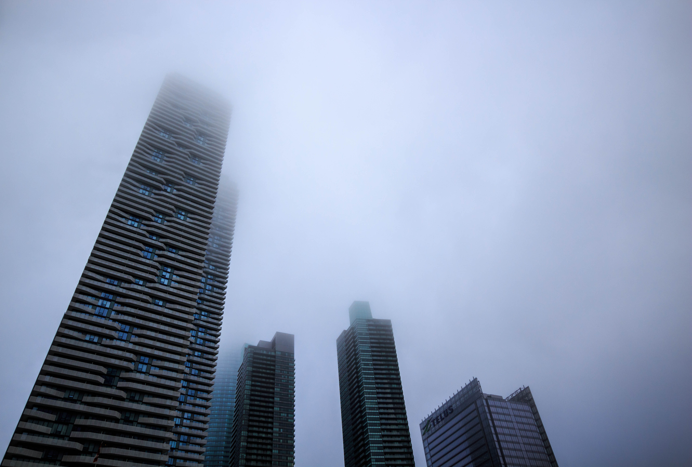

<DIV align="justify">

<br> 


```{r, echo=FALSE,out.width="100%", out.height="100%",fig.cap="[Harpa](https://en.wikipedia.org/wiki/Harpa_(concert_hall)) - Reykjavík, Iceland",fig.show='hold',fig.align='center'}

``` 

<br>

```{r, echo=FALSE,out.width="100%", out.height="100%",fig.cap="[Kubuswoningen](https://en.wikipedia.org/wiki/Cube_house) - Rotterdam, Netherlands",fig.show='hold',fig.align='center'}

``` 

<br>

```{r, echo=FALSE,out.width="100%", out.height="100%",fig.cap="[Havenhuis](https://en.wikipedia.org/wiki/Port_Authority_Building_(Antwerp)) - Antwerp, Belgium",fig.show='hold',fig.align='center'}
knitr::include_graphics("antwerp.jpg")
``` 

<br>

```{r, echo=FALSE,out.width="100%", out.height="100%",fig.cap="Toronto, Canada",fig.show='hold',fig.align='center'}

``` 

<br>

```{r, echo=FALSE,out.width="100%", out.height="100%",fig.cap="[Slovak Radio Building](https://en.wikipedia.org/wiki/Slovak_Radio_Building) - Bratislava, Slovakia",fig.show='hold',fig.align='center'}
knitr::include_graphics("bratislava.jpg")
``` 

<br>

```{r, echo=FALSE,out.width="100%", out.height="100%",fig.cap="Zlín, Czech Republic",fig.show='hold',fig.align='center'}

``` 

</DIV>

&nbsp;
<hr />
<p style="text-align: center;"><b>Go back to <a href="/projects/projects.html">Projects</b></a></p>